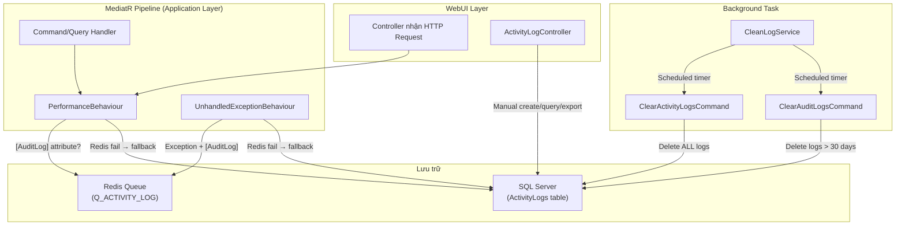
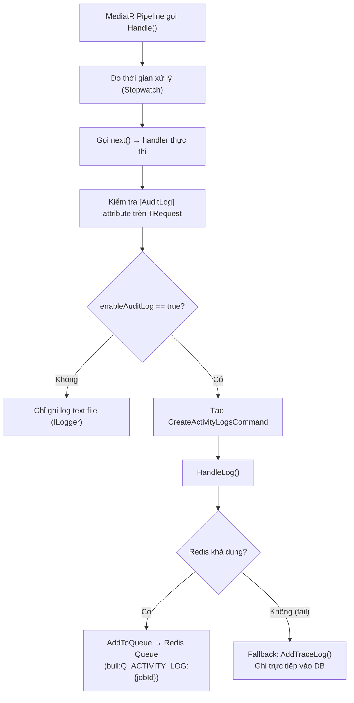

# 🔍 Phân Tích Tính Năng Activity Log — CallFlow Drive

## 1. Tổng Quan Kiến Trúc

Hệ thống Activity Log trong codebase này hoạt động theo mô hình **Audit Trail tự động** dựa trên MediatR Pipeline Behaviour, kết hợp với **Redis queue** để xử lý bất đồng bộ.



---

## 2. Entity — Domain Layer

**File:** [ActivityLog.cs](file:///d:/Year-4/Capstone/References/CallFlow%20Drive/Domain/Entities/ActivityLog.cs)

```csharp
public class ActivityLog : AuditableEntity
{
    public int Id { get; set; }
    public string Method { get; set; }       // HTTP Method (GET, POST, PUT, DELETE)
    public string UserId { get; set; }       // ID người dùng
    public string UserName { get; set; }     // Tên đăng nhập
    public string RemoteIp { get; set; }     // IP client
    public string Request { get; set; }      // Request body (thường null khi auto-log)
    public Company Company { get; set; }     // Navigation property → Company
    public string RequestName { get; set; }  // Tên hành động (từ AuditLog attribute)
    public string Response { get; set; }     // Response body (thường null khi auto-log)
    public string Status { get; set; }       // HTTP Status code
    public DateTimeOffset ActivityDate { get; set; }
}
```

Kế thừa từ [AuditableEntity.cs](file:///d:/Year-4/Capstone/References/CallFlow%20Drive/Domain/Common/AuditableEntity.cs) → thêm `Created`, `CreatedBy`, `LastModified`, `LastModifiedBy`.

> [!IMPORTANT]
> ActivityLog liên kết với **Company** (multi-tenant). Mỗi log gắn với company của user. Khi query, hệ thống filter theo company (trừ SuperAdmin thì xem được tất cả).

---

## 3. Cơ Chế Tự Động Ghi Log — MediatR Pipeline

### 3.1 `AuditLogAttribute` — Đánh Dấu Command/Query Cần Log

**File:** [PerformanceBehaviour.cs#L19-L29](file:///d:/Year-4/Capstone/References/CallFlow%20Drive/Application/Common/Behaviours/PerformanceBehaviour.cs#L19-L29)

```csharp
[AttributeUsage(AttributeTargets.Class)]
public class AuditLogAttribute : Attribute
{
    public string DisplayName { get; }        // Tên hiển thị trong log, VD: "Queue - Create"
    public bool EnableAuditLog { get; set; }  // Bật/tắt ghi log
}
```

**Cách dùng** — gắn attribute lên Command/Query:
```csharp
[AuditLog("Queue - Create", EnableAuditLog = true)]
public class CreateQueueCommand : IRequest<Result> { ... }

[AuditLog("Voicemails - Access", EnableAuditLog = true)]
public class GetVoiceMailListQuery : IRequest<VoiceMailVm> { ... }
```

### 3.2 `PerformanceBehaviour` — Ghi Log Khi Thành Công

**File:** [PerformanceBehaviour.cs#L30-L148](file:///d:/Year-4/Capstone/References/CallFlow%20Drive/Application/Common/Behaviours/PerformanceBehaviour.cs#L30-L148)

**Luồng xử lý:**



**Dữ liệu được ghi cho mỗi log:**

| Field | Nguồn | Mô tả |
|---|---|---|
| `RemoteIP` | `ICurrentUserService.IP` | IP client |
| `Status` | `ICurrentUserService.Code` | HTTP status code |
| `UserId` | `ICurrentUserService.UserId` | User ID |
| `UserName` | `ICurrentUserService.UserName` | Username |
| `Method` | `ICurrentUserService.Method` | HTTP method |
| `RequestName` | `AuditLogAttribute.DisplayName` | Tên hành động (VD: "Queue - Create") |
| `CompanyId` | `ICurrentUserService.CompanyId` | Company ID (multi-tenant) |
| `Request` | Luôn `null` khi auto-log | Không lưu request body |
| `Response` | Luôn `null` khi auto-log | Không lưu response body |

> [!NOTE]
> Request/Response body **không được lưu vào DB** khi auto-log (set `null`). Chỉ được serialize trong text log (`ILogger.LogInformation`). Đây là thiết kế có chủ đích để giảm dung lượng DB.

### 3.3 `UnhandledExceptionBehaviour` — Ghi Log Khi Xảy Ra Exception

**File:** [UnhandledExceptionBehaviour.cs](file:///d:/Year-4/Capstone/References/CallFlow%20Drive/Application/Common/Behaviours/UnhandledExceptionBehaviour.cs)

Cơ chế **giống hệt** `PerformanceBehaviour`, nhưng chạy khi handler throw exception. Cũng:
1. Check `[AuditLog]` attribute
2. Ưu tiên Redis queue → fallback trực tiếp DB
3. Sau đó **re-throw** exception (`throw;`)

---

## 4. Cơ Chế Lưu Trữ — Redis Queue + Fallback DB

### 4.1 Redis Queue (Primary)

**File:** [RedisService.cs#L158-L201](file:///d:/Year-4/Capstone/References/CallFlow%20Drive/Infrastructure/Services/RedisService.cs#L158-L201)

```
Key format:   bull:Q_ACTIVITY_LOG:{jobId}
Data format:  Hash { "opts": {...}, "data": <serialized CreateActivityLogsCommand> }
Wait list:    bull:Q_ACTIVITY_LOG:wait  (LPUSH jobId)
```

> [!TIP]
> Hệ thống sử dụng **Bull queue pattern** trên Redis. Điều này gợi ý rằng có một **worker riêng biệt** (có thể là Node.js hoặc service khác) đang consume queue `Q_ACTIVITY_LOG` và ghi vào DB. Worker này **không nằm trong codebase .NET** hiện tại.

### 4.2 Fallback — Ghi Trực Tiếp DB

Khi Redis không khả dụng (`AddToQueue` return `false`), hệ thống fallback gọi `AddTraceLog()` → ghi trực tiếp vào `context.ActivityLogs` (SQL Server).

---

## 5. Đăng Nhập Có Được Ghi Log Không?

> [!CAUTION]
> **KHÔNG.** Hành vi đăng nhập (Login) **KHÔNG** được ghi vào Activity Log.

**Lý do:**
1. `AuthController.Login()` gọi trực tiếp `identityService.Login()` — đây **không phải** MediatR command/query
2. Không có `[AuditLog]` attribute nào liên quan đến Login
3. Chỉ có `ChangeStatusOnlineWhenLogin` command được gửi qua MediatR (đổi status agent), nhưng command này **không có** `[AuditLog]` attribute

```csharp
// AuthController.cs — Login endpoint
[AllowAnonymous]
[HttpPost("login")]
public async Task<IActionResult> Login([FromBody] AuthenticateModel model)
{
    var rs = await identityService.Login(model.Email, model.Password, AccountType.CallFlow);
    // ↑ Gọi trực tiếp service, KHÔNG qua MediatR pipeline → KHÔNG trigger PerformanceBehaviour
}
```

---

## 6. Những Hành Vi Nào Được Ghi Log?

Chỉ các Command/Query có gắn `[AuditLog("...", EnableAuditLog = true)]` mới được ghi. Dưới đây là **một số ví dụ tiêu biểu**:

| Nhóm | Hành vi | RequestName trong log |
|---|---|---|
| **Queue** | Tạo, Sửa, Xóa, Disable, Recording | "Queue - Create/Update/Delete/Disable" |
| **Trunk** | Tạo, Sửa, Xóa, Reload, Disable | "Trunk - Create/Update/Delete/Reload" |
| **User** | Sửa thông tin, Đổi mật khẩu, Import | "User Information - Update", "Account - Change Password" |
| **Role** | Xem, Sửa, Xóa | "Roles - Access", "Role - Update/Delete" |
| **CallFlow** | Tạo, Sửa, Xóa, Clone | "CallFlow - Create/Update/Delete" |
| **Voicemail** | Xem, Export, Transcription | "Voicemails - Access/Export" |
| **Report** | Xem Usage, Export | "Usage Report - Access/Export" |
| **System** | System Logs, Audit Export | "System Logs - Access", "Audit Event - Export" |
| **Security** | Cập nhật setting | "Security Setting - Update" |

> [!WARNING]
> Nhiều command/query **KHÔNG** có `[AuditLog]` → không được ghi. Đặc biệt: **Login, Register, Logout, Refresh Token** đều không được ghi.

---

## 7. Background Tasks — Dọn Dẹp Log

### 7.1 `CleanLogService`

**File:** [CleanLogService.cs](file:///d:/Year-4/Capstone/References/CallFlow%20Drive/WebUI/BackGroundTask/CleanLogService.cs)

- Là `BackgroundService` (.NET Hosted Service)
- Chạy **theo timer** cấu hình từ `AppSettings.CleanLogServiceRunInterval` (giây)
- Bật/tắt bằng `AppSettings.CleanLogServiceRun`
- Chạy 2 task song song:

| Task | Command | Hành vi |
|---|---|---|
| `ClearActivityLog` | `ClearActivityLogsCommand` | **Xóa TẤT CẢ** activity logs có `Created.Date <= now` |
| `ClearSystemLog` | `ClearSystemLogsCommand` | Xóa system logs |

### 7.2 `ClearActivityLogsCommand` vs `ClearAuditLogsCommand`

| | ClearActivityLogsCommand | ClearAuditLogsCommand |
|---|---|---|
| **File** | [ClearActivityLogsCommand.cs](file:///d:/Year-4/Capstone/References/CallFlow%20Drive/Application/ActivityLogs/Command/ClearActivityLogsCommand/ClearActivityLogsCommand.cs) | [ClearAuditLogsCommand.cs](file:///d:/Year-4/Capstone/References/CallFlow%20Drive/Application/ActivityLogs/Command/ClearAuditLogsCommand/ClearAuditLogsCommand.cs) |
| **Logic** | Xóa **TẤT CẢ** log (`Created.Date <= now`) | Xóa log **cũ hơn 30 ngày** |
| **Được gọi từ** | `CleanLogService` (Background timer) | Chưa thấy caller nào (có thể từ scheduler) |

> [!WARNING]
> `ClearActivityLogsCommand` xóa **toàn bộ** activity logs mỗi lần chạy (`al.Created.Date <= currentDateTime` — tức luôn đúng). Đây có thể là bug hoặc thiết kế "xóa sạch rồi ghi lại".

---

## 8. API Endpoints — ActivityLogController

**File:** [ActivityLogController.cs](file:///d:/Year-4/Capstone/References/CallFlow%20Drive/WebUI/Controllers/ActivityLogController.cs)

| Method | Route | Mô tả |
|---|---|---|
| `GET` | `/system/ActivityLog` | Query logs (pagination, sort, date range) |
| `POST` | `/system/ActivityLog/all` | Query logs (POST body, advanced filter) |
| `POST` | `/system/ActivityLog` | Tạo log thủ công (từ client) |
| `POST` | `/system/ActivityLog/export` | Export logs ra CSV (byte[]) |

> [!NOTE]
> Endpoint `Create` bổ sung `RemoteIP` từ `HttpContext.Connection.RemoteIpAddress` trước khi gửi vào handler.

---

## 9. Tổng Kết — Bản Đồ File Liên Quan

```
📁 Domain/
├── 📁 Common/
│   └── AuditableEntity.cs            ← Base class (Created, CreatedBy, ...)
├── 📁 Entities/
│   └── ActivityLog.cs                ← Entity chính
│
📁 Application/
├── 📁 ActivityLogs/
│   ├── 📁 Command/
│   │   ├── CreateActivityLogsCommand/
│   │   │   └── CreateActivityLogsCommand.cs    ← Tạo log (manual endpoint + pipeline)
│   │   ├── ClearActivityLogsCommand/
│   │   │   └── ClearActivityLogsCommand.cs     ← Xóa TẤT CẢ log
│   │   ├── ClearAuditLogsCommand/
│   │   │   └── ClearAuditLogsCommand.cs        ← Xóa log > 30 ngày
│   │   └── ExportActivityLogsCommand/
│   │       └── ExportActivityLogsCommand.cs    ← Export CSV
│   └── 📁 Query/
│       └── GetAllActivityLogs/
│           ├── GetAllActivityLogs.cs           ← Query with pagination/filter
│           ├── ActivityLogDto.cs               ← DTO + AutoMapper mapping
│           └── ActivityLogVm.cs                ← ViewModel (list + page)
│
├── 📁 Common/
│   ├── 📁 Behaviours/
│   │   ├── PerformanceBehaviour.cs             ← ⭐ AUTO-LOG: ghi log khi success
│   │   └── UnhandledExceptionBehaviour.cs      ← ⭐ AUTO-LOG: ghi log khi exception
│   └── 📁 Interfaces/
│       ├── ICurrentUserService.cs              ← Metadata: UserId, IP, Method, ...
│       └── IRedisService.cs                    ← Redis queue interface
│
📁 Infrastructure/
├── 📁 Persistence/
│   └── ApplicationDbContext.cs                 ← DbSet<ActivityLog> ActivityLogs
├── 📁 Services/
│   └── RedisService.cs                         ← Redis implementation (Bull queue)
│
📁 WebUI/
├── 📁 Controllers/
│   ├── ActivityLogController.cs                ← REST API endpoints
│   └── AuthController.cs                       ← Login (KHÔNG có AuditLog)
└── 📁 BackGroundTask/
    └── CleanLogService.cs                      ← Scheduled log cleanup
```

---

## 10. Nhận Xét & Điểm Đáng Lưu Ý

| # | Vấn Đề | Chi Tiết |
|---|---|---|
| 1 | ❌ **Login không được log** | `AuthController.Login()` bypass MediatR pipeline hoàn toàn |
| 2 | ⚠️ **ClearActivityLogsCommand xóa hết** | Condition `Created.Date <= now` luôn đúng → xóa sạch mỗi lần chạy |
| 3 | 🔄 **Redis queue → external worker** | Logs được đẩy vào Redis Bull queue, cần worker ngoài .NET để consume |
| 4 | 🔀 **Duplicate code** | `HandleLog()` + `AddTraceLog()` giống nhau 100% ở cả 2 behaviour |
| 5 | 🏢 **Multi-tenant** | Logs được filter theo Company, SuperAdmin xem all |
| 6 | 📭 **Request/Response body không lưu DB** | Chỉ log ra file text, DB chỉ lưu metadata |
| 7 | ⏰ **Không có retention policy rõ ràng** | `ClearAuditLogsCommand` giữ 30 ngày nhưng `ClearActivityLogsCommand` xóa hết |
